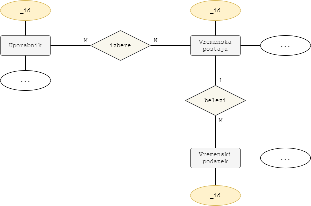
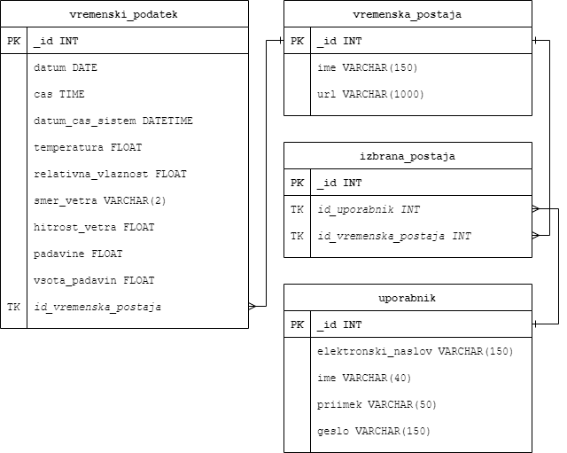
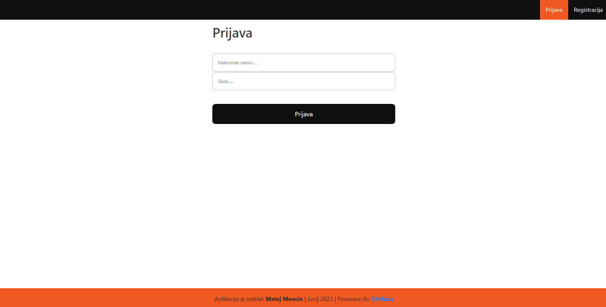
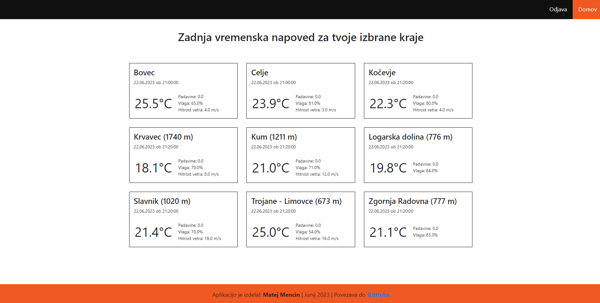

# Zajem vremenskih podatkov
Pripravil: Matej Mencin

Junij 2023

> ## Navodila
>
> Razvoj programske kode za avtomatiziran zajem vremenskih podatkov s spletne strani Agencije Republike Slovenije za okolje (ARSO):
>
> - konkretno gre za 2-dnevni arhiv podatkov različnih vremenskih spremenljivk (temperatura, oblačnost, vlažnost…)
> - več o vsebini podatkov na naslednjem naslovu pod poglavjem »Opis podatkov«: https://meteo.arso.gov.si/met/sl/service/
> - primer linka, od koder se pripravi zajem XML datoteke za lokacijo KRANJ: https://meteo.arso.gov.si/uploads/probase/www/observ/surface/text/sl/recent/observationAms_KRANJ_history.xml. Na enak način se da zajeti tudi podatke drugih vremenskih postaj.
>
> 
>
> **Naloga**
>
> - Napiši programsko kodo v Pythonu, ki bo vsako uro samodejno pridobivala podatke za poljuben nabor lokacij.
> - Nalogo objavi na katerem od Git arhivskih okolij, kot je na primer BitBucket ali GitHub. 
> - Pripravi osnutek zasnove SQL podatkovne baze za MySQL, ki bi se lahko uporabila za shranjevanje in obdelavo pridobljenih podatkov. Ta del naloge ni obvezen, vendar bo štel v vašo korist pri ocenjevanju vašega celotnega znanja in izkušenj.

## Podatkovna baza

Za nalogo sem si zamislil preprosto podatkovno bazo z entitetami `Uporabnik`,  `Vremenska postaja`  in  `Vremenski podatek`. Ideja je, da posameznik oz. `Uporabnik` izbere vremenske postaje, ki jih želi spremljati; v aplikaciji se mu za izbrane vremenske postaje prikazujejo vremenski podatki. V podatkovno bazo se vsako uro shranjujejo podatki vseh vremenskih postaj.

> Podatkovno bazo bi lahko nagradili, da bi imeli več atributov. Za ta ilustrativni primer podatkovne baze sem dodal le nekaj izbranih atributov.

#### E-R diagram:

#### Logični diagram:

## Programska koda

Programska koda je razdeljena v dva dela: 

1. programska koda, ki je namenjena zajemanju podatkov (direktorij `zajem_podatkov`)

2. programska koda, ki je namenjena spletni aplikaciji (direktorij `spletna_aplikacija`)

### Zajemanje podatkov

V direktoriju `zajemanje_podatkov` imamo naslednje datoteke:

- datoteka `pridobi_postaje_xml.py`, ima funkcijo, ki poskrbi, da s spletne strani pridobi vremenske postaje.
- datoteka `pridobi_vreme_xml.py`, ima funkcijo, ki poskrbi, da za izbrano vremensko postajo, pridobimo podatke o trenutnem vremenu.
- datoteka `zajem_postaj_pb.py`, ima funkcijo, ki poskrbi, da se vremenske postaje shranijo v podatkovno bazo.
- datoteka `zajem_vreme_pb.py`, ima funkcijo, ki poskrbi, da se vremenski podatki za določeno vremensko postajo shranijo v podatkovno bazo.
- datoteka `main.py`, ima funkcijo, ki kliče zgoraj opisane funkcije.

## Spletna aplikacija

Spletna aplikacija je dostopna na IP-ju: `http://127.0.0.1:5000/`.

Napisana je v programskem jeziku Python z uporabo knjižnic Flask in SQLAlchemy.

Trenutna različica prikazuje registriranemu in prijavljenemu uporabniku vreme za vremenske postaje, ki si jih je izbral za prikaz.

**Prijavno okno:**

**Prikaz vremenskih podatkov za izbrane kraje:**

