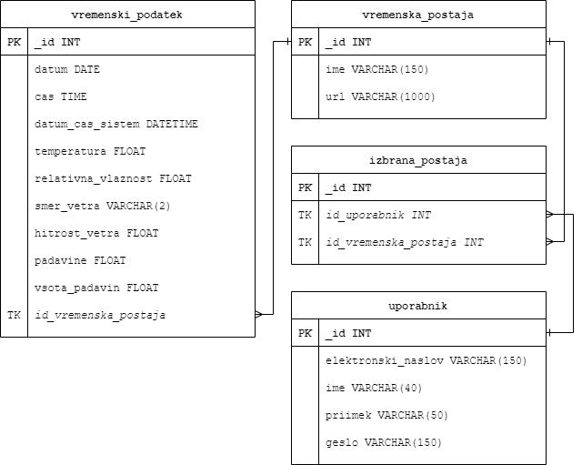

# Zajem vremenskih podatkov
Pripravil: Matej Mencin

Junij 2023

## Navodila

Razvoj programske kode za avtomatiziran zajem vremenskih podatkov s spletne strani Agencije Republike Slovenije za okolje (ARSO):

- konkretno gre za 2-dnevni arhiv podatkov različnih vremenskih spremenljivk (temperatura, oblačnost, vlažnost…)
- več o vsebini podatkov na naslednjem naslovu pod poglavjem »Opis podatkov«: https://meteo.arso.gov.si/met/sl/service/
- primer linka, od koder se pripravi zajem XML datoteke za lokacijo KRANJ: https://meteo.arso.gov.si/uploads/probase/www/observ/surface/text/sl/recent/observationAms_KRANJ_history.xml. Na enak način se da zajeti tudi podatke drugih vremenskih postaj.

**Naloga**

- Napiši programsko kodo v Pythonu, ki bo vsako uro samodejno pridobivala podatke za poljuben nabor lokacij.
- Nalogo objavi na katerem od Git arhivskih okolij, kot je na primer BitBucket ali GitHub. 
- Pripravi osnutek zasnove SQL podatkovne baze za MySQL, ki bi se lahko uporabila za shranjevanje in obdelavo pridobljenih podatkov. Ta del naloge ni obvezen, vendar bo štel v vašo korist pri ocenjevanju vašega celotnega znanja in izkušenj.

## Podatkovna baza

Za nalogo sem si zamislil preprosto podatkovno bazo. Ideja je, da posameznik oz. uporabnik izbere vremenske postaje, ki jih želi spremljati; v aplikaciji pa se mu nato za izbrane vremenske postaje prikazujejo vremenski podatki.

V podatkovni bazi nastopajo naslednje entitete:

- Entiteta `uporabnik ` z smiselnimi atributi.
- Entiteta `vremenska_postaja` z smiselnimi atributi.
- Entiteta `vremenski_podatek` z smiselnimi atributi.

#### E-R diagram:

#### Logični diagram:

## Aplikacija

